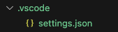
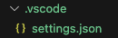
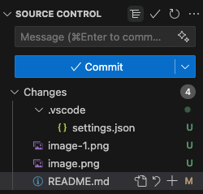

# dev-settings
Settings for improve dev experience

## VSCode settings
### `settings`
- `User` - Settings that apply globally to any instance of VS Code you open.
- `Workspace` - Settings stored inside your workspace and only apply when the workspace is opened.

Look at the .vscode/settings.json for the configurations

> [!WARNING]  
> Workspace settings are specific to a project and override user settings.

||
|:--:|
| *Figure 1: With more indentation* |

||
|:--:|
| *Figure 2: Without more indentation* |

### Tree viewing in source control

Click the icon right next to `SOURCE CONTROL`

||
|:--:|
| *Figure 3: Changing the source control viewing by `tree`*|